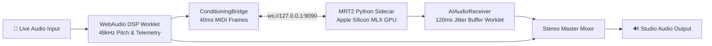

# PulseJam AI — Real-Time On-Device Audio Companion

> An intelligent, zero-latency audio studio companion that listens to your live instrument and streams reactive neural backing tracks in real time.


---

## 📖 Description

**PulseJam AI** is a real-time, 100% on-device AI studio companion designed for musicians and producers. By analyzing incoming microphone or audio interface signals directly in the browser through low-latency WebAudio DSP worklets, PulseJam AI detects fundamental pitch, attack dynamics, and performance energy. 

It dynamically conditions **Google Magenta RealTime 2 (MRT2)** via a native Apple Silicon MLX GPU sidecar, streaming continuous, responsive stereo backing audio back into a multi-track studio console—completely offline, private, and with sub-20ms generation latency.

---

## 📑 Table of Contents

- [Description](#-description)
- [System Architecture](#-system-architecture)
- [Key Features](#-key-features)
- [Installation](#-installation)
- [Usage](#-usage)
  - [1. Running in Web Development Mode](#1-running-in-web-development-mode)
  - [2. Using the Studio Console](#2-using-the-studio-console)
  - [3. Building the macOS Desktop App](#3-building-the-macos-desktop-app)
- [Project Structure](#-project-structure)
- [Contributing](#-contributing)
- [License](#-license)

---

## 🏗️ System Architecture

PulseJam AI coordinates client-side WebAudio DSP with a native MLX inference sidecar over local WebSockets:



### Core Pipeline:
1. **Client DSP Telemetry**: Dedicated WebAudio `AudioWorklet` (`dsp-processor.js`) performing monophonic YIN pitch tracking (C2–C6), RMS dB calculation, and onset dynamics detection.
2. **Conditioning Bridge**: Packages 40ms `ConditioningFrame` payloads (128-element General MIDI pitch states, active tier prompts, and confidence gating).
3. **MRT2 MLX Sidecar**: Native Python engine executing Google Magenta RealTime 2 small model via Apple Silicon MLX GPU (~15ms per 40ms frame).
4. **AI Audio Receiver**: Dedicated jitter buffer worklet (`ai-receiver-processor.js`) absorbing latency variance for uninterrupted playback.
5. **Master Mixer**: Multi-track GainNode mixer combining live instrument and AI stream with independent monitoring controls.

---

## 🎛️ Key Features

- **⚡ Sub-20ms On-Device Generation**: Continuous stereo audio companion streaming locally via Apple Silicon MLX GPU acceleration.
- **🎯 Dynamic Confidence Gating**: Automatically falls back between `midi+audio` and `audio-only` conditioning based on acoustic confidence.
- **🎚️ Multi-Lane Studio Console**: Integrated DAW console with multi-lane track controls, live waveforms, and real-time buffer telemetry.
- **🎛️ Acoustic Calibration Wizard**: 3-step noise floor and acoustic threshold calibration for studio-grade isolation.
- **🖥️ Standalone Desktop App**: Native desktop companion built with Tauri v2 embedding a relocatable standalone runtime.

---

## 📦 Installation

### Prerequisites
- **Operating System**: macOS (Apple Silicon M-series recommended for MLX GPU acceleration)
- **Node.js**: v20.0.0 or higher
- **Rust & Cargo**: Required for building the Tauri desktop application
- **Python**: 3.11 with `mlx` and `magenta-rt` (for local sidecar development)

### Step-by-Step Setup

```bash
# 1. Clone the repository
git clone https://github.com/aaronnguyen26/pulsejam.git
cd pulsejam

# 2. Install Node.js dependencies
npm install

# 3. Verify test suite passes
npm test
```

---

## 🚀 Usage

### 1. Running in Web Development Mode

To run PulseJam AI in your local browser:

```bash
# Terminal 1: Start Next.js development server
npm run dev

# Terminal 2: Start the native MRT2 MLX WebSocket Sidecar
npm run sidecar
```

Open [http://localhost:3000](http://localhost:3000) in your browser (Chrome or Safari recommended for Web Audio Worklet support).

### 2. Using the Studio Console

1. Navigate to `/studio` or click **Launch Studio** from the landing page.
2. Click **Start Calibration** to run the 3-step acoustic noise-floor check.
3. Select your performance tier (**Chill**, **Groove**, **Peak**) or set custom style prompts.
4. Play your instrument—the AI stream will continuously generate responsive accompaniment matching your tempo and harmonic progression.
5. Adjust independent mix sliders for live input and AI output in real time.

### 3. Building the macOS Desktop App

To bundle PulseJam AI as a native standalone macOS application (`.dmg` / `.app`):

```bash
# Build the production frontend and Tauri desktop binary
npm run tauri:build
```

The resulting installer will be located in `src-tauri/target/release/bundle/dmg/`.

---

## 📁 Project Structure

```
pulsejam/
├── src/
│   ├── app/                    # Next.js App Router (Landing & Studio routes)
│   ├── components/             # Active studio screens, modals, and telemetry UI
│   │   ├── screens/            # MultiLaneMIDIStudioScreen, StudioHubRefinedScreen, etc.
│   │   └── RefinedCalibrationModal.tsx
│   └── lib/audio/              # AudioEngine, ConditioningBridge, AIAudioReceiver
├── scripts/
│   └── sidecar/                # Native MRT2 MLX WebSocket server (sidecar_server.py)
├── src-tauri/                  # Tauri v2 desktop host & native permissions
└── public/
    └── worklets/               # Low-latency AudioWorklet DSP processors
```

---

## 🤝 Contributing

Contributions, issues, and feature requests are welcome!

1. **Fork the Repository**
2. **Create a Feature Branch** (`git checkout -b feature/amazing-feature`)
3. **Ensure All Tests Pass**:
   ```bash
   npm test
   npm run build
   ```
4. **Commit Your Changes** (`git commit -m 'feat: add amazing feature'`)
5. **Push to the Branch** (`git push origin feature/amazing-feature`)
6. **Open a Pull Request**

Please ensure your code follows the existing ESLint and TypeScript conventions.

---

## 📄 License

This project is licensed under the **MIT License** — see the [LICENSE](LICENSE) file for details.
