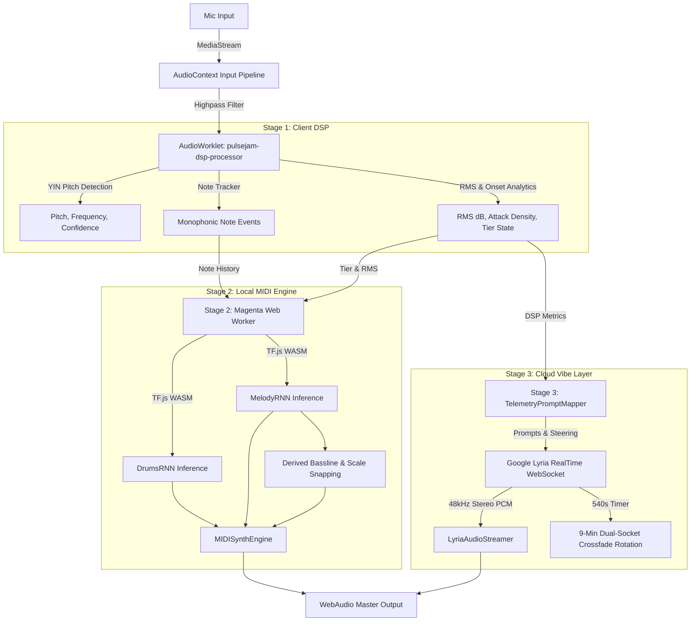

# PulseJam AI — Unified Multi-Lane AI Studio Console & Desktop Companion

PulseJam AI is a 100% client-side, zero-backend Next.js application and native desktop studio companion. It listens to live instrument input via microphone or audio interface, extracts real-time audio telemetry, generates 1-bar lookahead MIDI accompaniment locally, and streams ambient generative textures from the cloud.

It unifies real-time WebAudio DSP, local WASM AI inference, Google Lyria RealTime WebSocket streaming, and standalone native desktop packaging into a seamless studio workspace.

---

## 🏗️ System Architecture Diagram

```
                                  +---------------------------------------+
                                  |    Live Instrument / Microphone       |
                                  +---------------------------------------+
                                                      |
                                                      v
                                  +---------------------------------------+
                                  |      WebAudio API Input Pipeline      |
                                  |  MediaStreamSource -> GainNode        |
                                  |  -> BiquadFilter (80Hz Highpass)      |
                                  +---------------------------------------+
                                                      |
                                                      v
                                  +---------------------------------------+
                                  |        Stage 1: Client DSP            |
                                  |  AudioWorklet (dsp-processor.js)      |
                                  |  - YIN Pitch Tracker (C2-C6)          |
                                  |  - EMA RMS dB & Onset Density         |
                                  |  - Monophonic Note Event Segmenter    |
                                  |  - State Machine (Chill/Groove/Peak)  |
                                  +---------------------------------------+
                                         /                         \
                                        /                           \
                                       v                             v
+-------------------------------------------------+   +-------------------------------------------------+
|          Stage 2: Local AI MIDI Engine          |   |          Stage 3: Cloud "Vibe" Layer            |
|   Web Worker (src/lib/audio/magenta-worker.ts)  |   |         Lyria RealTime WebSocket API          |
|   - TensorFlow.js WASM Backend                  |   |   - Direct WebSocket Connection (wss://...)     |
|   - DrumsRNN (drum_kit) & MelodyRNN (basic_rnn) |   |   - BYOK API Key (localStorage)                 |
|   - 1-Bar Lookahead Accompaniment Generation    |   |   - TelemetryPromptMapper (3s Throttled)        |
|   - Root-Locked Bass & Scale Snapping           |   |   - Weighted Prompts, Density & Brightness      |
|   - Algorithmic Fallback Generator              |   |   - 9-Min Dual-Socket Crossfade Rotation        |
+-------------------------------------------------+   +-------------------------------------------------+
                        |                                                     |
                        v                                                     v
+-------------------------------------------------+   +-------------------------------------------------+
|      MIDISynthEngine (WebAudio Oscillator)      |   |   LyriaAudioStreamer (48kHz Stereo PCM Buffer)  |
+-------------------------------------------------+   +-------------------------------------------------+
                        \                                                     /
                         \                                                   /
                          v                                                 v
                      +---------------------------------------------------------+
                      |         WebAudio Master Destination (Speakers)          |
                      +---------------------------------------------------------+
```

### Data Flow Diagram (Mermaid)



---

## 📊 Stage 2 (Local MIDI) vs. Stage 3 (Cloud Audio) Comparison

| Feature / Dimension | Stage 2: Local AI MIDI Engine | Stage 3: Cloud "Vibe" Layer |
|---|---|---|
| **Primary Role** | Real-time 1-bar lookahead MIDI accompaniment (Drums, Lead Synth, Bass) | Continuous ambient/textural audio background overlay |
| **Model / Engine** | Google Magenta.js (`DrumsRNN`, `MelodyRNN`) with TF.js WASM backend | Google Lyria RealTime (`models/lyria-realtime-exp`) |
| **Execution Context** | Off-main-thread Web Worker (`src/lib/audio/magenta-worker.ts`) | Direct WebSocket client stream (`wss://generativelanguage.googleapis.com`) |
| **Latency Profile** | Ultra-low local WASM inference (~10–30ms) | Model response latency (~3000ms steering update window) |
| **Output Format** | Quantized MIDI Sequences (Synthesized via `MIDISynthEngine`) | 48kHz Stereo PCM Audio stream |
| **Credentials & Cost** | 100% Client-Side / Zero API Keys / Free | BYOK Google AI Studio API Key (`localStorage`) |
| **Offline Capability** | Fully functional offline (with pre-cached CDN/model assets) | Requires active internet connection |
| **Session Bounds** | Unlimited continuous playback | 9-minute (540s) dual-socket 500ms crossfade rotation protocol |
| **Steering Inputs** | Primed monophonic note sequence & active performance tier | RMS dB, attack density, pitch note name, continuous density & brightness |

---

## 🌟 Architectural Deep-Dive

### 1. Client DSP Telemetry Layer (Stage 1)
- **AudioWorklet Architecture**: Core signal processing runs inside a dedicated WebAudio `AudioWorkletProcessor` (`public/worklets/dsp-processor.js`) registered as `pulsejam-dsp-processor`.
- **YIN Monophonic Pitch Tracker**:
  - Implements the complete YIN pitch detection algorithm in pure JS within the worklet context.
  - Computes fundamental frequency ($f_0$), clarity/confidence, and MIDI note numbers across the human vocal/instrument range ($60\text{ Hz}$ to $1200\text{ Hz}$, C2 to C6).
  - Uses a 4-step process: difference function, cumulative mean normalized difference, absolute threshold search (0.15 threshold), and parabolic interpolation for sub-sample accuracy.
- **Rolling Raw PCM Audio Buffer**:
  - Maintains a 3-second continuous rolling `Float32Array` PCM audio buffer (`audioRingBuffer`) separate from the YIN pitch buffer.
  - Supports non-blocking `GET_AUDIO_SNAPSHOT` worklet message pattern returning raw audio PCM snapshots on demand.
- **Extended Calibration & Dual Persistence Split**:
  - **3-Step Calibration (`quiet`, `loud`, `phrase`)**: Captures noise floor, peak dynamics, composite pitch confidence, and derives `pitchRangeLow` and `pitchRangeHigh` from phrase pitch events.
  - **Numeric Calibration Persistence (`localStorage`)**: Persists numeric thresholds (`quietDb`, `normalDb`, `loudDb`, `pitchRangeLow`, `pitchRangeHigh`, `conditioningMode`, `toneSampleRef`) via Zustand `calibrationStore.ts` in `localStorage`. Automatically restores calibration on session startup.
  - **Tone Sample Audio Clip Storage (`IndexedDB`)**: Stores raw 2-4 second PCM audio clips captured during calibration in IndexedDB (`toneSampleStorage.ts`), keyed by `toneSampleRef`.
- **ConditioningBridge & Future Inference Sidecar Protocol**:
  - **40ms Conditioning Frame Cadence**: `ConditioningBridge.ts` runs an independent 40ms timer producing `ConditioningFrame` payloads containing a 128-element General MIDI pitch state array ($0 = \text{off}$, $1 = \text{onset}$, $2 = \text{sustain}$), tier-derived style prompts (`chill` $\rightarrow$ `"sparse ambient"`, `groove` $\rightarrow$ `"steady groove"`, `peak` $\rightarrow$ `"driving energetic"`), and live operational mode.
  - **Live Confidence Gating & Calibration Ceiling Rule**: Evaluates rolling pitch confidence. Drops live mode from `'midi+audio'` to `'audio-only'` if confidence drops below threshold for sustained ticks. Enforces a strict ceiling rule: live mode can **never** upgrade past the calibration-time ceiling (`conditioningMode`).
  - **WebSocket Sidecar Manager & Status Surfacing**: Manages connection to a local native inference sidecar (`SidecarStatus`: `'unavailable'`, `'connecting'`, `'connected'`, `'high-latency'`). Performs ping/pong latency handshakes (`roundTripMs`), automatic reconnect backoff, and features a dry-run debug mode when no sidecar is connected.
- **Telemetry Extraction & Reactive Tier State Machine**:
  - **RMS dB**: Exponential Moving Average (EMA) smoothed amplitude ($\alpha = 0.15$).
  - **Attack Density**: Onset detection with a 45ms refractory period and 1.0-second rolling window ($\alpha = 0.18$).
  - **Monophonic Note Tracker**: Automatically segments raw continuous pitch into discrete note events (`pitch`, `velocity`, `startTime`, `duration`).
  - **Reactive Tier State Machine**: Dynamically classifies live playing into three tiers (`chill`, `groove`, `peak`) with a 350ms dwell time hysteresis to prevent jitter. Emits `TIER_CHANGE` events with latency instrumentation (`deltaMs`).
- **Known Issues Fixed**:
  - **Real-Time Pitch Confidence Tracking**: Fixed an issue in `dsp-processor.js` where `pitchConfidence` retained stale values on noisy or low-confidence frames ($\le 0.4$). `pitchConfidence` is now updated continuously on every YIN result and resets to 0 when no periodicity is detected.
  - **Timestamp Domain Alignment**: Added `wallClockTimestamp` (epoch ms) to `DSPMetrics` in `AudioEngine.ts` alongside context-relative `timestamp` (sec). `ConditioningBridge.ts` checks stream staleness (`metricsStalenessMs`, default 200ms) and forces all-zero pitch states and `'audio-only'` mode if telemetry stalls.
  - **IndexedDB Test Coverage**: Integrated genuine IndexedDB mock transactions into `stage1Redesign.test.ts` to test saving, reading back, and deleting Float32Array PCM audio clips via `toneSampleStorage.ts`.

### 2. Local AI MIDI Engine (Stage 2)
- **Off-Thread Web Worker**: Runs in `src/lib/audio/magenta-worker.ts` off the main UI and WebAudio threads using `@magenta/music` and `@tensorflow/tfjs-backend-wasm`.
- **Dual-Model Inference**:
  - **DrumsRNN**: Loaded from GCS checkpoint (`music_rnn/drum_kit`), generating 1-bar quantized drum sequences from primed rhythm patterns (`createDrumPrimerFromRhythm`).
  - **MelodyRNN**: Loaded from GCS checkpoint (`music_rnn/basic_rnn`), generating 1-bar lead synth continuations from the live monophonic pitch history.
- **Harmonic Bass & Scale Snapping**:
  - Derives root-locked basslines (`deriveBasslineSequence`) matched to the generated melody.
  - Constrains all generated notes to musical scales (`snapSequenceToScale`) defined in `src/lib/audio/magentaLogic.ts`.
- **Algorithmic Fallbacks**: If WASM initialization or network fetching fails, automatically falls back to lightweight deterministic rhythm and melody generators without breaking the session.

### 3. Cloud "Vibe" Layer (Stage 3 — BYOK)
- **Lyria RealTime Model Integration**: Streams generative ambient textures from Google's `models/lyria-realtime-exp` via direct bidirectional WebSockets (`wss://generativelanguage.googleapis.com/ws/...`).
- **100% BYOK Security**: Google AI Studio API key is stored strictly in `localStorage` (`pulsejam_google_api_key`) and sent directly to Google. No third-party proxy server touched.
- **Telemetry-to-Steering Mapping (`TelemetryPromptMapper.ts`)**:
  - Maps live DSP metrics every 3 seconds to weighted text prompts (e.g., `"ethereal ambient synth pad"`, `"driving energetic lead synth pulse"`, `"harmonic key of C4"`).
  - Computes continuous **Density** ($0.1$ to $1.0$) based on onset attack frequency and **Brightness** ($0.1$ to $1.0$) based on input volume and pitch height.
- **PCM Audio Streamer (`LyriaAudioStreamer.ts`)**: Decodes 48kHz stereo PCM chunks (Int16 / Float32 / Base64) and schedules WebAudio buffer sources with a 50ms jitter buffer.
- **9-Minute Dual-Socket Session Rotation Protocol**:
  - Google Lyria RealTime WebSocket connections hard-cap at 10 minutes (600s).
  - `LyriaSessionManager.ts` tracks active session time. At **540 seconds (9 minutes)**, it connects a secondary WebSocket in the background (`secondarySession`).
  - Once the secondary socket receives its setup frame and buffers initial audio, `LyriaAudioStreamer` executes a **500ms linear crossfade** (`fadeOutAndStop`), closes the old socket, and seamlessly swaps to the new session without audio dropout.

### 4. macOS Standalone Desktop App (Stage 4)
- **Tauri v2 Packaging**: Native macOS desktop app configured in `src-tauri/tauri.conf.json`.
- **Microphone Authorization**: Declares `NSMicrophoneUsageDescription` in `src-tauri/Info.plist` to prompt users for native macOS audio hardware access.
- **Security & Network CSP**: Configures explicit Content Security Policy allowlists for direct WebSocket connections (`wss://generativelanguage.googleapis.com`) and model CDN dependencies (`https://storage.googleapis.com`, `https://cdn.jsdelivr.net`).
- **Build Target**: Compiles Next.js static export (`npm run build` -> `out/`) into an unsigned `.dmg` installer via `npm run tauri:build`.

---

## 🎛️ Console UI & Multi-Lane Architecture

The main studio screen (`/studio`) provides a multi-lane AI DAW console interface:

- **Track Lane Architecture**:
  - **Live Input (`AUDIO TRACK 01`)**: Captures mic/interface audio.
  - **Lead Synth (`MIDI TRACK 01`)**: Renders MelodyRNN lead lines.
  - **Bassline (`MIDI TRACK 02`)**: Renders derived bassline sequences.
  - **Drums Companion (`MIDI TRACK 03`)**: Renders DrumsRNN patterns.
  - **Custom Tracks**: Dynamic track addition via `AddTrackModal.tsx`.
- **Track Controls (MUTE / SOLO / REC)**:
  - **MUTE**: Instantly silences audio output for that track in both live generation and playback.
  - **SOLO**: Isolates soloed tracks, silencing all non-soloed tracks.
  - **REC Arming**: Per-lane arming. Live Input REC captures isolated audio; MIDI REC generates AI MIDI for that lane only; Global Transport REC records all armed tracks in sync.
- **Global Transport Clocking**: Driven by WebAudio `AudioContext.currentTime`, maintaining master BPM, bar counter, and syncing stored audio takes with generated MIDI bar sequences.
- **60fps Canvas Visualizer**: Real-time `requestAnimationFrame` loop in `Visualizer.tsx` rendering golden peak amplitude waveform bars (`#f2ca50`) and MIDI note rolls.

---

## 📱 App Navigation Structure

The application features a 3-screen studio workspace:

1. **WELCOME** (`ImmersiveWelcomeHomeScreen`): Interactive studio initialization & onboarding.
2. **STUDIO HUB** (`StudioHubRefinedScreen`): Session overview, acoustic input status, and track setup.
3. **MIDI STUDIO** (`MultiLaneMIDIStudioScreen`): Full multi-lane AI studio console.

---

## 🛠️ Build Targets (Single Codebase)

### 1. Web App Build Target
```bash
# Install dependencies
npm install

# Run local web dev server (http://localhost:3000 = Website, http://localhost:3000/studio = App UI)
npm run dev

# Static export build (generates out/ directory)
npm run build
```

### 2. Standalone macOS Desktop App Build Target (Tauri)
```bash
# Run Tauri in dev mode (opens desktop app directly to studio console)
npm run tauri:dev

# Build production unsigned macOS .dmg installer
npm run tauri:build
```
The output `.dmg` installer is generated at `src-tauri/target/release/bundle/dmg/PulseJam_0.1.0_aarch64.dmg` and hosted at `/downloads/PulseJam_0.1.0_aarch64.dmg` for free download on the marketing website (`/`).

---

##  Stage 4 Desktop App & Gatekeeper Guidance

### 1. Native macOS Microphone Permission Manifest
Microphone usage is declared in `src-tauri/Info.plist`:
```xml
<key>NSMicrophoneUsageDescription</key>
<string>PulseJam listens to your live instrument playing to dynamically crossfade backing stems and generate AI accompaniment in real time.</string>
```

### 2. Network CSP Allowlist for Stage 3 Cloud Layer
Tauri Content Security Policy allows direct WebSocket streaming to Google AI APIs:
```
connect-src 'self' wss://generativelanguage.googleapis.com https://storage.googleapis.com https://cdn.jsdelivr.net blob: data:;
```

### 3. Unsigned Build Gatekeeper Bypass Instructions
> [!IMPORTANT]
> **First-Time macOS Launch (Unsigned Build)**:
> Because this standalone desktop app is intentionally built unsigned (avoiding annual developer subscription fees), macOS Gatekeeper will block double-clicking on first launch ("PulseJam can't be opened because it is from an unidentified developer").
>
> **How to bypass Gatekeeper on first launch**:
> 1. Drag **PulseJam.app** from the `.dmg` into your **Applications** folder.
> 2. In Applications, **Right-Click** (or Control-Click) **PulseJam.app** and select **Open**.
> 3. Click **Open** in the confirmation dialog. *(This one-time step authorizes the app for all future double-click launches).*
> 4. If macOS security flags persist, run: `xattr -cr /Applications/PulseJam.app` in Terminal.

---

## 🎯 Stage 3 BYOK Setup & Security Notices

### 1. BYOK Setup Instructions
1. Click **BYOK Settings ⚙️** on the Cloud Vibe toolbar.
2. Enter your personal **Google AI Studio API Key** (`AIzaSy...`).
3. Click **Save & Enable**.
4. Toggle **Cloud Vibe: ON**. Live ambient textures generated by Google's Lyria RealTime model will blend into your session.

### 2. Public Deployment Security Warning
> [!CAUTION]
> **API Key Storage & DevTools Visibility**:
> The API key is stored strictly in your browser's `localStorage` and sent directly via WebSocket to Google's API (`generativelanguage.googleapis.com`).
> **If you deploy PulseJam AI to a publicly accessible URL, NEVER share or hardcode a single API key across visitors.** Every visitor must supply their OWN key in their browser Settings panel.

### 3. Personal Billing Notice
> [!WARNING]
> **Personal Account Billing**:
> Usage of the Cloud Vibe layer makes real API calls billed to your personal Google AI Studio account per Google's pricing. Use the red **[STOP CLOUD VIBE]** button whenever you finish playing to disconnect immediately.

---

## 📜 Model Checkpoints & Licensing Notice

Stage 2 uses pretrained Google Magenta model checkpoints (`drum_kit` and `basic_rnn`) hosted on Google Cloud Storage. Review official Magenta license terms at [Google Magenta Repository](https://github.com/magenta/magenta-js).

