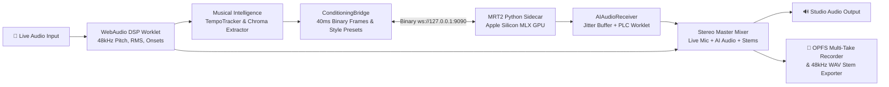

# PulseJam AI — Real-Time On-Device Audio Companion

> An intelligent, zero-latency audio studio companion that listens to your live instrument and streams reactive neural backing tracks in real time.


---

## 📖 Description

**PulseJam AI** is a real-time, 100% on-device AI studio companion designed for musicians, guitarists, synthesists, and vocalists. By analyzing incoming microphone or audio interface signals directly in the browser through low-latency WebAudio DSP worklets, PulseJam AI detects fundamental pitch, attack dynamics, tempo, and key tonality.

It dynamically conditions **Google Magenta RealTime 2 (MRT2)** via a native Apple Silicon MLX GPU sidecar, streaming continuous, responsive stereo backing audio back into a multi-track studio console—completely offline, private, and with sub-20ms generation latency.

---

## 📑 Table of Contents

- [Description](#-description)
- [System Architecture](#-system-architecture)
- [Key Features](#-key-features)
- [Installation](#-installation)
- [Usage](#-usage)
  - [1. Running in Web Development Mode](#1-running-in-web-development-mode)
  - [2. Using the Studio Console](#2-using-the-studio-console)
  - [3. Building the macOS Desktop App](#3-building-the-macos-desktop-app)
- [Project Structure](#-project-structure)
- [Contributing](#-contributing)
- [License](#-license)

---

## 🏗️ System Architecture

PulseJam AI coordinates client-side WebAudio DSP with a native MLX inference sidecar over high-performance binary WebSockets:



### Core Technical Pillars:
1. **Binary Zero-Copy Audio Streaming**: Packed 16-byte header (`[Magic 'PJ' | MsgType | Seq | Timestamp]`) + raw interleaved `Float32Array` PCM audio bytes ($1920 \times 2 = 3840$ floats $= 15,360$ bytes), replacing JSON text serialization.
2. **Acoustic Count-In & Real-time Tempo Tracking**: Inter-Onset Interval (IOI) autocorrelation calculating live BPM (40–240 BPM) with hands-free 4-beat acoustic count-in.
3. **12-Bin Chroma Profiler & Key Estimator**: Computes Pitch Class Profiles and applies the Krumhansl-Schmuckler Key-Finding algorithm in real time.
4. **Curated Musical Style Presets**: Signature genre catalogue (*Neo-Soul Warmth*, *Lo-Fi Midnight*, *Indie Rock Drive*, *Synthwave 80s*, *Cinematic Ambient*, *Funk Pocket*).
5. **Hardware Ergonomics & Web MIDI**: Native Web MIDI pedalboard / footswitch support (CC#64 Sustain Pedal toggle, CC#81/82 tier shifting).
6. **OPFS Multi-Take Recording & Stem Export**: Crash-resilient chunked jam recorder with broadcast-grade 16-bit 48kHz stereo WAV export.

---

## 🎛️ Key Features

- **⚡ Sub-20ms On-Device Generation**: Continuous stereo audio companion streaming locally via Apple Silicon MLX GPU acceleration.
- **🚀 Binary Zero-Copy Protocol**: 15KB binary WebSocket chunks with sub-1ms serialization overhead.
- **🎸 Hands-Free Acoustic Count-In**: 4-beat rhythmic tap/strum auto-locks BPM and arms recording.
- **🎼 Live Key & Tonality Detection**: Real-time Krumhansl-Schmuckler harmonic analysis.
- **🎹 Web MIDI Footswitch Integration**: Hands-free pedalboard control for guitarists and keyboardists.
- **💾 OPFS Multi-Take Management**: Infinite-length jam recording without browser memory exhaustion.
- **📦 48kHz WAV Stem Exporter**: One-click DAW drag-and-drop stem exports for Ableton, Logic, Pro Tools, and Reaper.
- **🎯 Dynamic Confidence Gating**: Automatically falls back between `midi+audio` and `audio-only` conditioning.
- **🖥️ Standalone Desktop App**: Native desktop companion built with Tauri v2.

---

## 📦 Installation

### Prerequisites
- **Operating System**: macOS (Apple Silicon M-series recommended for MLX GPU acceleration)
- **Node.js**: v20.0.0 or higher
- **Rust & Cargo**: Required for building the Tauri desktop application
- **Python**: 3.11 with `mlx` and `magenta-rt` (for local sidecar development)

### Step-by-Step Setup

```bash
# 1. Clone the repository
git clone https://github.com/aaronnguyen26/pulsejam.git
cd pulsejam

# 2. Install Node.js dependencies
npm install

# 3. Verify test suite passes (36 unit & integration tests)
npm test
```

---

## 🚀 Usage

### 1. Running in Web Development Mode

To run PulseJam AI in your local browser:

```bash
# Terminal 1: Start Next.js development server
npm run dev

# Terminal 2: Start the native MRT2 MLX WebSocket Sidecar
npm run sidecar
```

Open [http://localhost:3000](http://localhost:3000) in your browser (Chrome or Safari recommended for Web Audio Worklet support).

### 2. Using the Studio Console

1. Navigate to `/studio` or click **Launch Studio** from the landing page.
2. Click **Start Calibration** to run the 3-step acoustic noise-floor check.
3. Select your musical style preset (**Neo-Soul**, **Lo-Fi**, **Indie Rock**, **Synthwave**, etc.).
4. Use **4-Beat Acoustic Count-In** or press your MIDI sustain pedal to start jamming.
5. Play your instrument—the AI companion continuously generates responsive accompaniment matching your tempo, energy, and key center.
6. Click **EXPORT .WAV** to download broadcast-grade 48kHz WAV stems for your DAW.

### 3. Building the macOS Desktop App

To bundle PulseJam AI as a native standalone macOS application (`.dmg` / `.app`):

```bash
# Build the production frontend and Tauri desktop binary
npm run tauri:build
```

The resulting installer will be located in `src-tauri/target/release/bundle/dmg/`.

---

## 📁 Project Structure

```
pulsejam/
├── src/
│   ├── app/                    # Next.js App Router (Landing & Studio routes)
│   ├── components/             # Active studio screens, modals, and telemetry UI
│   │   ├── screens/            # MultiLaneMIDIStudioScreen, StudioHubRefinedScreen, etc.
│   │   └── RefinedCalibrationModal.tsx
│   └── lib/audio/              # AudioEngine, ConditioningBridge, AIAudioReceiver,
│                               # TempoTracker, ChromaFeatureExtractor, WebMIDIManager,
│                               # OPFSRecorder, StemExporter, StylePresets
├── scripts/
│   └── sidecar/                # Native MRT2 MLX WebSocket server (sidecar_server.py)
├── src-tauri/                  # Tauri v2 desktop host & native permissions
└── public/
    └── worklets/               # Low-latency AudioWorklet DSP processors
```

---

## 🤝 Contributing

Contributions, issues, and feature requests are welcome!

1. **Fork the Repository**
2. **Create a Feature Branch** (`git checkout -b feature/amazing-feature`)
3. **Ensure All Tests Pass**:
   ```bash
   npm test
   npm run lint
   npm run build
   ```
4. **Commit Your Changes** (`git commit -m 'feat: add amazing feature'`)
5. **Push to the Branch** (`git push origin feature/amazing-feature`)
6. **Open a Pull Request**

Please ensure your code follows the existing ESLint and TypeScript conventions.

---

## 📄 License

This project is licensed under the **MIT License** — see the [LICENSE](LICENSE) file for details.
