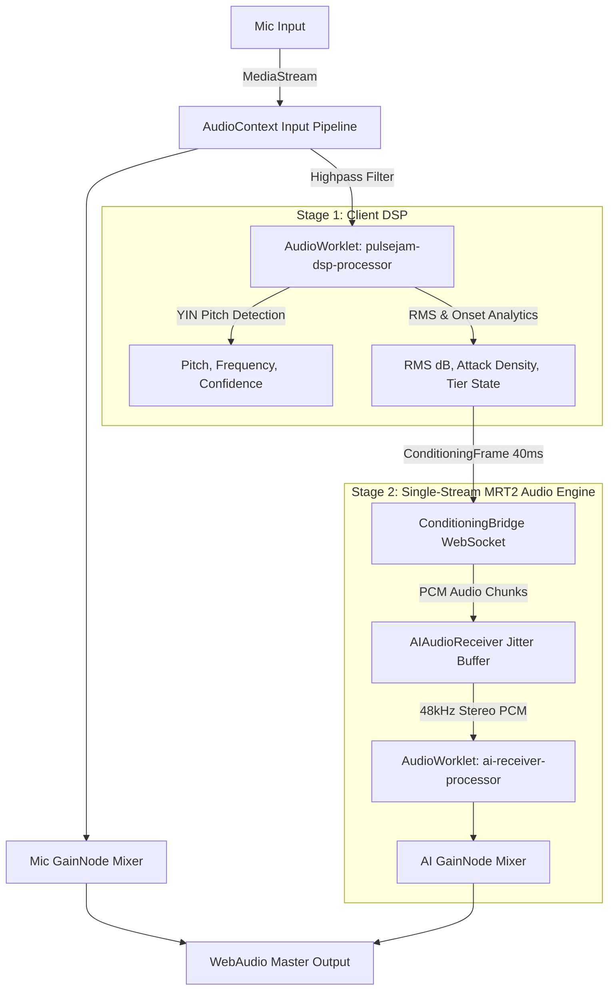

# PulseJam AI — Unified Multi-Lane AI Studio Console & Desktop Companion

PulseJam AI is a 100% client-side, zero-backend Next.js application and native desktop studio companion. It listens to live instrument input via microphone or audio interface, extracts real-time audio telemetry, and receives a continuous single-stream MRT2 audio companion generated locally on-device.

It unifies real-time WebAudio DSP, single-stream MRT2 continuous audio generation via `AIAudioReceiver`, and standalone native desktop packaging into a seamless studio workspace.

---

## 🏗️ System Architecture Diagram

```
                                  +---------------------------------------+
                                  |    Live Instrument / Microphone       |
                                  +---------------------------------------+
                                                      |
                                                      v
                                  +---------------------------------------+
                                  |      WebAudio API Input Pipeline      |
                                  |  MediaStreamSource -> GainNode        |
                                  |  -> BiquadFilter (80Hz Highpass)      |
                                  +---------------------------------------+
                                                      |
                                                      v
                                  +---------------------------------------+
                                  |        Stage 1: Client DSP            |
                                  |  AudioWorklet (dsp-processor.js)      |
                                  |  - YIN Pitch Tracker (C2-C6)          |
                                  |  - EMA RMS dB & Onset Density         |
                                  |  - State Machine (Chill/Groove/Peak)  |
                                  +---------------------------------------+
                                                      |
                                                      v
                         +-------------------------------------------------+
                         |     Stage 2: Single-Stream MRT2 AI Receiver     |
                         |       AIAudioReceiver (src/lib/audio/...)       |
                         |   - 40ms PCM Chunks (float32, 48kHz, stereo)    |
                         |   - 120ms Jitter Buffer (3 Chunks Target)       |
                         |   - Sequence Gap & Underrun Detection           |
                         |   - Worklet (ai-receiver-processor.js)          |
                         |   - Mixer Stage (Independent Gain Controls)     |
                         +-------------------------------------------------+
                                              |
                                              v
                       +---------------------------------------------------------+
                       |         WebAudio Master Destination (Speakers)          |
                       +---------------------------------------------------------+
```

### Data Flow Diagram (Mermaid)



---

## 📊 Stage 2 (Single-Stream MRT2 Audio) Architecture Summary

| Feature / Dimension | Stage 2: Single-Stream MRT2 Audio Engine |
|---|---|
| **Primary Role** | Real-time continuous single-stream audio companion |
| **Model / Engine** | Google MRT2 (Real-Time Audio Stream) via local MLX sidecar |
| **Execution Context** | Standalone `AIAudioReceiver.ts` + Worklet (`ai-receiver-processor.js`) |
| **Input Interface** | Generic `pushChunk(pcmData, sequenceNumber, timestamp)` |
| **Output Format** | 40ms 48kHz Stereo PCM Audio Chunks (1920 samples/channel) |
| **Jitter Absorption** | 3-chunk (120ms) target jitter buffer with sequence gap tracking |
| **UI Integration** | Single collapsed "AI Companion" track with real-time level/waveform visualization |
| **Mixer Control** | Independent GainNode mixer stage (`setMicMixGain`, `setAIAudioMixGain`) |

---

## 🌟 Architectural Deep-Dive

### 1. Client DSP Telemetry Layer (Stage 1)
- **AudioWorklet Architecture**: Core signal processing runs inside a dedicated WebAudio `AudioWorkletProcessor` (`public/worklets/dsp-processor.js`) registered as `pulsejam-dsp-processor`.
- **YIN Monophonic Pitch Tracker**:
  - Implements the complete YIN pitch detection algorithm in pure JS within the worklet context.
  - Computes fundamental frequency ($f_0$), clarity/confidence, and MIDI note numbers across the human vocal/instrument range ($60\text{ Hz}$ to $1200\text{ Hz}$, C2 to C6).
  - Uses a 4-step process: difference function, cumulative mean normalized difference, absolute threshold search (0.15 threshold), and parabolic interpolation for sub-sample accuracy.
- **ConditioningBridge Protocol**:
  - `ConditioningBridge.ts` runs an independent 40ms timer producing `ConditioningFrame` payloads containing General MIDI pitch states, tier-derived style prompts, and dynamic confidence-gated operational mode.
  - Manages WebSocket connection to the inference sidecar (`SidecarStatus`: `'unavailable'`, `'connecting'`, `'connected'`, `'high-latency'`). Performs ping/pong latency handshakes (`roundTripMs`), automatic reconnect backoff, and features dry-run debug support.

---

### 2. Single-Stream MRT2 Audio Engine (Stage 2)
- **Legacy Code Removal**: Removed legacy Magenta.js MIDI generation pipeline (`AIGenerationEngine.ts`, `magenta-worker.ts`, `magentaLogic.ts`, `MIDISynthEngine.ts`, and `@magenta/music`, `@tensorflow/tfjs` dependencies).
- **AIAudioReceiver Component (`AIAudioReceiver.ts`)**:
  - Decoupled, standalone receiver with generic `pushChunk(pcmData, sequenceNumber, timestamp)` interface.
  - Parses 40ms PCM audio chunks (float32, 48kHz, stereo, (1920, 2) samples per chunk).
  - Maintains a small jitter buffer (target depth 3 chunks = 120ms, max 50 chunks = 2.0s) to absorb arrival-time variance between chunks without dropping audio or scheduling chunks too early.
  - **State Machine**: Transitions through `'idle'` $\rightarrow$ `'buffering'` $\rightarrow$ `'streaming'` $\rightarrow$ `'stalled'`.
  - **Gap & Underrun Detection**: Detects sequence number gaps (`sequenceNumber > expectedSequenceNumber`), updates `underrunCount`, and preserves frame alignment.
  - **Stream Restart Handling**: Detects stream stops and sequence number resets, cleanly resetting internal queues and resuming correct buffering/playback.
  - **Metrics Surfacing**: Exposes real-time metrics (`AIAudioStreamMetrics`: `state`, `bufferDepthMs`, `bufferDepthChunks`, `underrunCount`, `lastChunkTimestamp`).
- **WebAudio Output Worklet (`public/worklets/ai-receiver-processor.js`)**:
  - Dedicated AudioWorkletProcessor (`pulsejam-ai-receiver-processor`) consuming stereo Float32Array PCM samples from `AIAudioReceiver` and streaming to WebAudio destination at 48kHz.
- **Mixer Stage (`AudioEngine.ts`)**:
  - Dedicated `GainNode` mixer combining live mic signal path (`micGainNode`) and AI audio stream path (`aiGainNode`) into `masterGainNode` $\rightarrow$ `ctx.destination`.
  - Exposes independent gain controls (`setMicMixGain`, `setAIAudioMixGain`, `setMasterGain`).
- **ConditioningBridge Wiring**:
  - `ConditioningBridge.ts` routes incoming binary/audio WebSocket messages (`AUDIO_CHUNK` / ArrayBuffer / Blob) directly to `aiAudioReceiver.pushChunk()`. Handled gracefully when sidecar is unreachable (`state: 'unavailable'`).

---

### 2b. Native Tauri Sidecar Process (`scripts/sidecar/sidecar_server.py`)
- **Primary Role**: Native MLX GPU-accelerated process serving Google Magenta RealTime 2 (`mrt2_small`) inference over local WebSockets for real-time audio companion generation.
- **Python Virtual Environment**: Uses isolated sandbox virtualenv at `experiments/mrt2-sanity-check/venv` (Python 3.11, `mlx`, `magenta-rt`, `websockets`).
- **Model Asset Dependencies**: Uses compiled `mrt2_small` model weights (230M params, 435MB `.mlxfn`) and MusicCoCa style encoders validated in `/experiments/mrt2-sanity-check`.
- **WebSocket Protocol (`ws://127.0.0.1:9090`)**:
  - **Latency Handshake**: Receives `{ type: 'ping', timestamp }` and responds immediately with `{ type: 'pong', timestamp }` (echoing timestamp for `ConditioningBridge` RTT calculation).
  - **Health Acknowledgment**: Sends `{ type: 'sidecar_status', status: 'healthy', version: '2.0.0-m2', mrt2Loaded: true }` upon client connection.
  - **Conditioning Frame Receiver**: Receives 40ms `CONDITIONING_FRAME` payloads containing 128-element General MIDI pitch states (`-1` = masked, `0` = note off, `1` = sustain, `2` = onset, `3` = free play), active tier style prompts, and operational mode.
  - **Audio Chunk Streamer**: Generates 40ms 48kHz stereo Float32 PCM audio chunks (`(1920, 2)` samples) and streams JSON-wrapped `AUDIO_CHUNK` messages back over WebSocket:
    ```json
    {
      "type": "AUDIO_CHUNK",
      "sequenceNumber": 0,
      "timestamp": 1723223645123,
      "pcmData": [
        [ /* 1920 left channel floats */ ],
        [ /* 1920 right channel floats */ ]
      ]
    }
    ```
- **Real-Time Performance**: Achieves ~15.5ms per 40ms frame (2.56x real-time headroom on Apple M2 GPU), maintaining a stable 2000ms (50 chunks) jitter buffer with 0 underruns during continuous playback.

#### Tauri Process Lifecycle (current)

The sidecar is **Tauri-managed**: it is spawned automatically when the Tauri desktop app starts and terminated when the app quits. No manual `npm run sidecar` step is needed when running via the desktop app.

**How it works:**
- `src-tauri/tauri.conf.json` registers `binaries/sidecar` under `bundle.externalBin`.
- `src-tauri/src/main.rs` uses `tauri-plugin-shell` to call `app.shell().sidecar("sidecar").spawn()` in the `setup` hook.
- A `ctrlc` signal handler (SIGTERM + SIGINT) kills the child process before exit, preventing orphaned sidecar processes even when Tauri is terminated externally (e.g. OS kill, `kill <pid>`).
- `src-tauri/binaries/sidecar-aarch64-apple-darwin` is a **wrapper shell script** (not a compiled binary) that activates the local venv and uses `exec` to replace itself with the Python interpreter — so Tauri's child PID maps directly to the Python process with no intermediate shell orphan.

**Verified behavior (evidence):**
```
# Cold start — no manual steps
[PulseJam] MRT2 sidecar spawned (PID managed by Tauri)
[sidecar stderr] PROJECT_ROOT: /Users/.../pulsejam
[sidecar stderr] Starting PulseJam MRT2 sidecar via venv Python...

# After model load (~12-15s): ping/pong succeeds
{"type": "sidecar_status", "status": "healthy", "mrt2Loaded": true}
✅ STANDALONE BINARY PING/PONG SUCCESSFUL! RTT: 1 ms

# On Tauri SIGTERM: sidecar is killed, port freed, no orphan
[PulseJam] Signal received — terminating MRT2 sidecar before exit...
[PulseJam] MRT2 sidecar terminated.
lsof -i :9090 → (nothing)
ps aux | grep sidecar_server → (none)
```

**Runtime dependency:** The sidecar still requires `experiments/mrt2-sanity-check/venv` to be present on the machine. Full standalone bundling (no venv dependency) is deferred — see note below.

> [!WARNING]
> **Hardcoded path in the wrapper script — not portable as-is.**
> `src-tauri/binaries/sidecar-aarch64-apple-darwin` contains a hardcoded fallback path:
> ```bash
> PROJECT_ROOT="/Users/minhnguyen/Desktop/Coding/pulsejam"
> ```
> This fallback fires whenever Tauri launches the script from a working directory where
> the relative path (`$SCRIPT_DIR/../..`) doesn't resolve to the project root (which is
> the normal case for `tauri dev` and the debug binary). If the project directory is
> moved, renamed, or checked out on a different machine, **the sidecar will fail to start**
> with `ERROR: venv Python not found`. This is an accepted limitation of the Option 2
> wrapper approach — full portability requires either (a) the PyInstaller standalone
> bundling work deferred to Stage 3, or (b) updating the hardcoded path before use.
> To override without editing the script, set the `PULSEJAM_ROOT` environment variable
> to the absolute project root before launching Tauri.


#### Deferred: PyInstaller Standalone Bundling (Stage 3)

A PyInstaller single-binary approach was attempted and partially built (~233MB executable) but cannot be used yet due to two confirmed failures:

1. **`sequence_layers.mlx` not bundled** — `magenta_rt.mlx.*` modules depend on `sequence_layers.mlx`, which PyInstaller's static import graph analysis misses entirely:
   ```
   missing module named 'sequence_layers.mlx' - imported by magenta_rt.mlx.system,
     magenta_rt.mlx.depthformer, magenta_rt.mlx.spectrostream.modeling ...
   ```
   Adding `--hidden-import sequence_layers.mlx` is the first step, but `sequence_layers` itself is not on PyPI and must be included via `--collect-all` or a custom hook.

2. **MLX is a namespace package** — `mlx.__file__` is `None` (namespace package), which breaks PyInstaller's collector. `mlx.core` is a native C++ extension (`core.cpython-311-darwin.so`) that links against Apple Metal (`/System/Library/Frameworks/Metal.framework`) and Accelerate frameworks. PyInstaller bundles `libmlx.dylib` correctly but silently drops the `magenta_rt.mlx` submodule namespace, causing runtime `ImportError` inside the frozen executable.

Do not attempt a fresh PyInstaller bundling from scratch without addressing both issues. The approach is viable but requires:
- A custom PyInstaller hook for `mlx` (marking it as a namespace package with explicit `datas`/`binaries` collection)
- Explicit `--collect-all sequence_layers` once it is resolvable
- Verification that `libmlx.dylib` rpath is correctly rewritten post-bundle

---

### 3. Original Stage 3 (Cloud Vibe Layer) — Archived

The original Stage 3 (Google Lyria RealTime cloud ambient layer) was archived on 2026-08-10 after MRT2's local generation quality was validated by ear and confirmed sufficient, superseding the original rationale for a cloud hybrid supplement. Its removal from the active roadmap caused desktop packaging to be renumbered from Stage 4 → Stage 3 (see section below). The full implementation is preserved at [`archive/stage3-lyria/`](archive/stage3-lyria/) with a restore guide.

---

### 4. macOS Standalone Desktop App (Stage 3)
- **Tauri v2 Packaging**: Native macOS desktop app configured in `src-tauri/tauri.conf.json`.
- **Microphone Authorization**: Declares `NSMicrophoneUsageDescription` in `src-tauri/Info.plist`.
- **Security & Network CSP**: Configures explicit Content Security Policy allowlists for direct WebSocket connections (`wss://generativelanguage.googleapis.com`).

---

## 🎛️ Console UI & Studio Architecture

The main studio screen (`/studio`) provides a refined AI DAW console interface:

- **Single AI Companion Track**:
  - Collapsed 3 legacy MIDI lanes (Lead Synth, Bassline, Drums Companion) into a single **"AI Companion"** track.
  - Displays a real-time stream level meter & buffer depth visualization driven by `AIAudioReceiver` metrics (replacing discrete piano-roll note rendering).
- **Independent Mix Controls**:
  - Live Input track slider controls mic mix gain (`setMicMixGain`).
  - AI Companion track slider controls AI audio mix gain (`setAIAudioMixGain`).
- **Stream Monitor (`AIGenerationMonitor.tsx`)**:
  - Displays ConditioningBridge sidecar round-trip latency (`roundTripMs`), `AIAudioReceiver` buffer depth (`bufferDepthMs`), underrun count, and stream state (`idle`, `buffering`, `streaming`, `stalled`).

---

## 📱 App Navigation Structure

1. **WELCOME** (`ImmersiveWelcomeHomeScreen`): Studio onboarding.
2. **STUDIO HUB** (`StudioHubRefinedScreen`): Session overview & acoustic input status.
3. **MIDI STUDIO** (`MultiLaneMIDIStudioScreen`): Full multi-lane AI studio console.

---

## 🛠️ Build Targets

```bash
# Install dependencies
npm install

# Run local web dev server
npm run dev

# Launch Stage 2 native MRT2 MLX WebSocket sidecar server (ws://localhost:9090)
# NOTE: Only needed for web dev mode. The Tauri desktop app auto-manages the sidecar.
npm run sidecar

# Run full Vitest unit & integration test suite
npm test


# Static export build (generates out/ directory)
npm run build

# Build production unsigned macOS .dmg installer (Tauri v2)
# The sidecar is spawned and killed automatically by the built app — no manual steps.
npm run tauri:build
```
