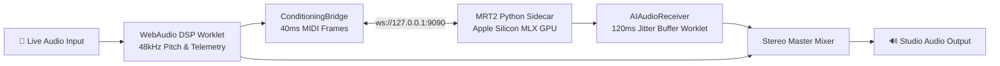

# PulseJam AI — Real-Time Multi-Lane AI Studio Companion


**PulseJam AI** is a real-time, zero-latency reactive audio studio companion. It listens to live instrument or microphone input, extracts acoustic pitch and dynamics telemetry in real time, and streams an on-device neural backing companion powered by **Google Magenta RealTime 2 (MRT2)** on Apple Silicon MLX.

---

## 🏗️ System Architecture

PulseJam AI coordinates client-side WebAudio DSP with a native MLX inference sidecar over local WebSockets:



### Core Audio Pipeline:
1. **Client DSP Telemetry**: Dedicated `AudioWorklet` (`dsp-processor.js`) running real-time monophonic YIN pitch detection (C2–C6), RMS dB calculation, and onset dynamics tracking.
2. **Conditioning Bridge**: Packages 40ms `ConditioningFrame` payloads (128-element General MIDI pitch states, active tier prompts, and dynamic confidence gating).
3. **MRT2 MLX Sidecar**: Native Python backend running Google Magenta RealTime 2 small model via Apple Silicon MLX GPU acceleration (~15ms per 40ms frame).
4. **AI Audio Receiver**: Dedicated jitter buffer worklet (`ai-receiver-processor.js`) absorbing network variance and maintaining continuous, click-free audio playback.
5. **Independent Mixer**: Multi-track GainNode mixer combining live instrument and AI stream with independent monitoring controls.

---

## 🎛️ Key Features

- **⚡ Sub-20ms On-Device AI Generation**: Real-time continuous stereo audio companion streaming locally via MLX GPU acceleration.
- **🎯 Dynamic Confidence Gating**: Automatically falls back between `midi+audio` and `audio-only` conditioning based on acoustic confidence.
- **🎚️ Multi-Lane Studio Console**: Integrated DAW console with multi-lane track controls, live waveforms, and real-time buffer telemetry.
- **🎛️ Acoustic Calibration Wizard**: 3-step noise floor and acoustic threshold calibration for studio-grade isolation.
- **🖥️ Standalone macOS App**: Native desktop companion built with Tauri v2 embedding a relocatable standalone runtime.

---

## 🚀 Quick Start & Development

### Prerequisites
- macOS (Apple Silicon M-series recommended for MLX GPU acceleration)
- Node.js 20+
- Rust (for Tauri desktop builds)

### Installation & Run

```bash
# 1. Install dependencies
npm install

# 2. Start Web Studio (Next.js)
npm run dev

# 3. Start Native MRT2 Audio Sidecar (for local web dev)
npm run sidecar

# 4. Run Vitest test suite
npm test

# 5. Build Desktop Application (macOS .dmg)
npm run tauri:build
```

---

## 📁 Project Structure

```
pulsejam/
├── src/
│   ├── app/                    # Next.js App Router (Landing & Studio routes)
│   ├── components/             # Active studio screens, modals, and telemetry UI
│   │   ├── screens/            # MultiLaneMIDIStudioScreen, StudioHubRefinedScreen, etc.
│   │   └── RefinedCalibrationModal.tsx
│   └── lib/audio/              # AudioEngine, ConditioningBridge, AIAudioReceiver
├── scripts/
│   └── sidecar/                # Native MRT2 MLX WebSocket server (sidecar_server.py)
├── src-tauri/                  # Tauri v2 desktop application & native permissions
└── public/
    └── worklets/               # Low-latency AudioWorklet DSP processors
```

---

## 📄 License & Credits

PulseJam AI is built with Next.js, Web Audio API, Google Magenta RealTime 2, MLX, and Tauri v2.
